# Diseño

## Diseño Principal

    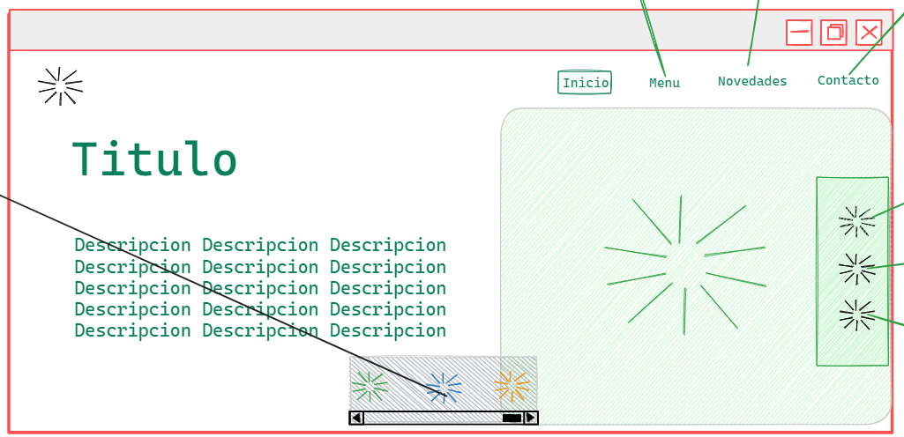

Como se puede ver en el diseño principal, contiene un header, se puede ver también que tiene el main divido en un 57% y 43% aproximadamente, dentro del panel de la derecha del main con un padding como del 5% tiene una caja centrada con un titulo de de tipo start dos lineas hacia abajo contiene un texto es muy probable que tenga que rellenarlo con lorem ipsum, en el header a la parte de la izquierda contiene un icono, en el main a la parte de la derecha contiene una imagen y ala derecha de este tambien contiene algunos links, por mi parte yo agregué algunas animaciones y un modo oscuro, como se puede ver a continuación.

### modo claro

    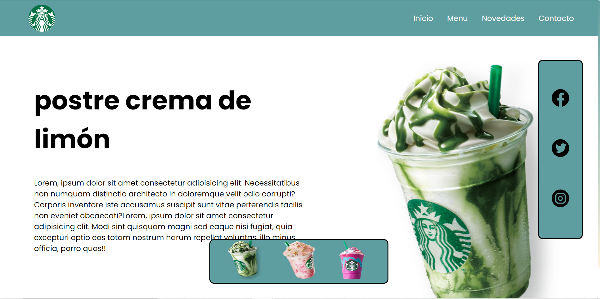

### modo oscuro

    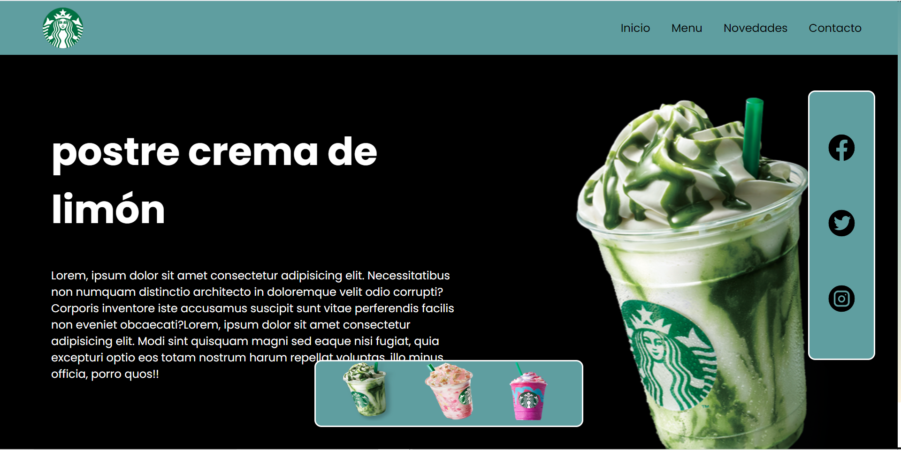

## Diseño Responsivo

    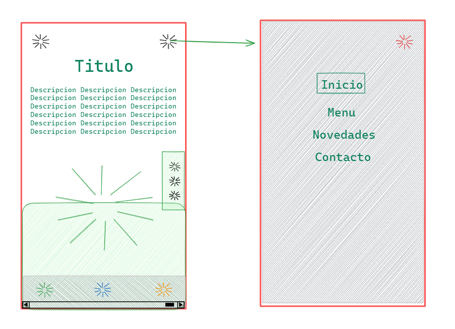

 
Como se puede apreciar el modo responsivo tiene un menu y los componentes cambian de lugar, estando anteriormente en fila, ahora están en columna, esto gracias al componente de media queries, junto con estas opciones también contiene un panel que abre y cierra en modo de celular

    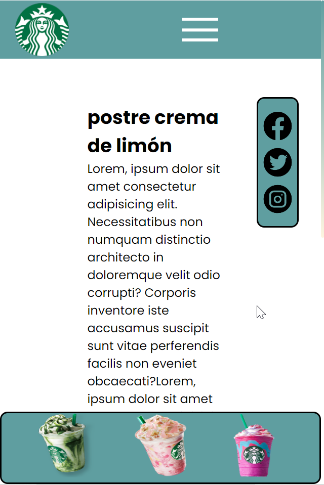

    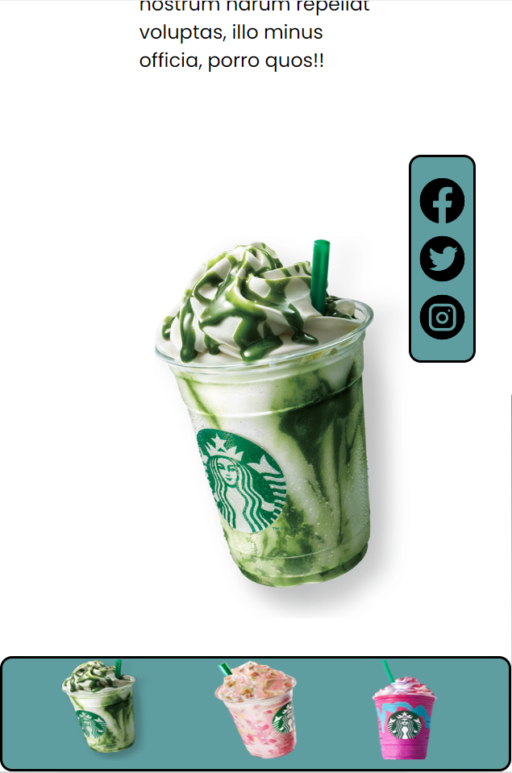
    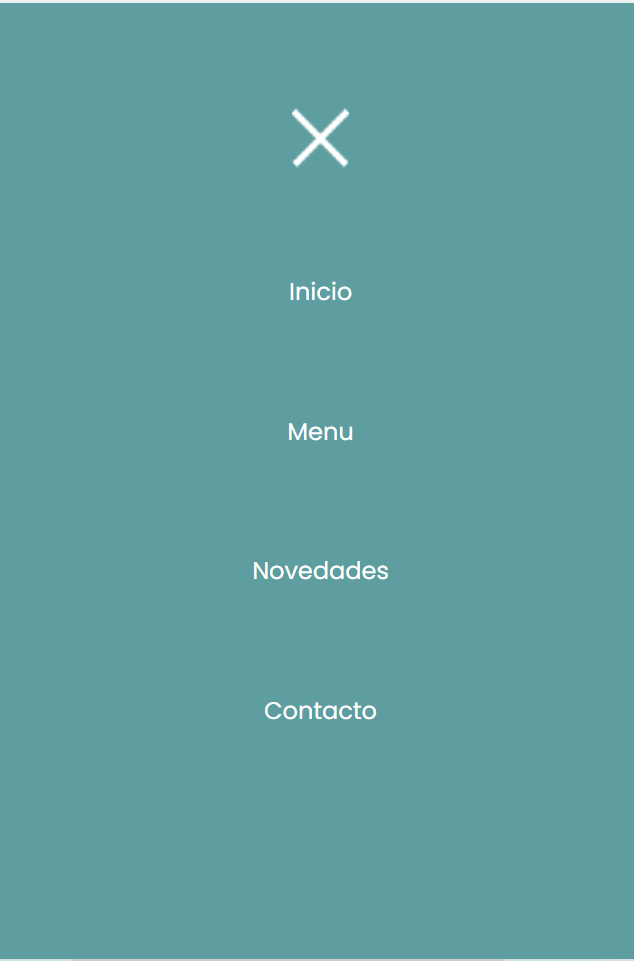

## Cambio de productos

    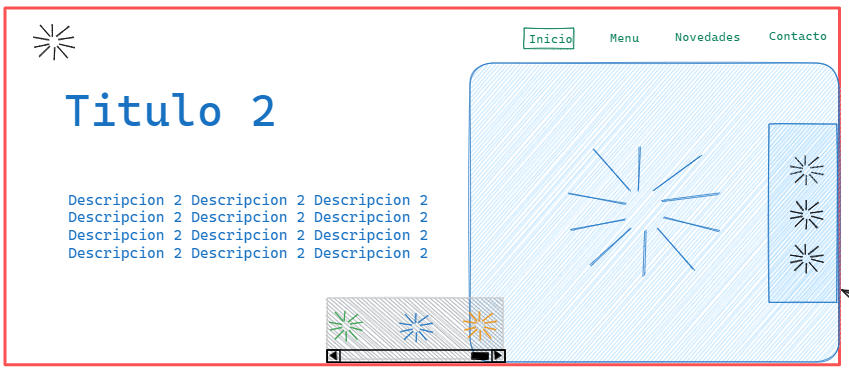

en el cambio de producto se cambian las imagenes junto con los titulos, el texto también puede cambiar dependiendo de lo que se necesite, recordar que todos los links esta referenciados a la pagina principal de starbucks

    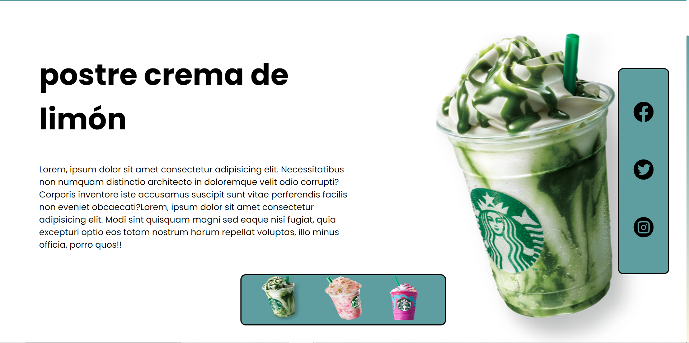

    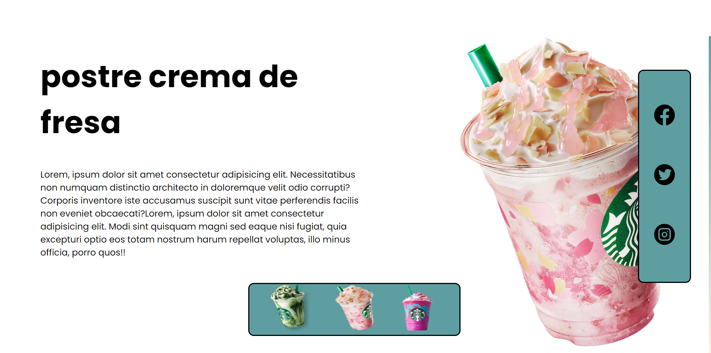

    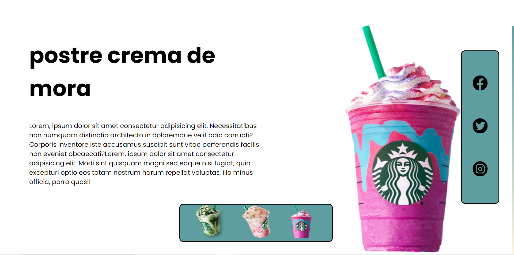

# Fuente

**Nombre:** Poppins

**Link:** https://fonts.google.com/specimen/Poppins?query=po

# Gracias Por Su Atención!!