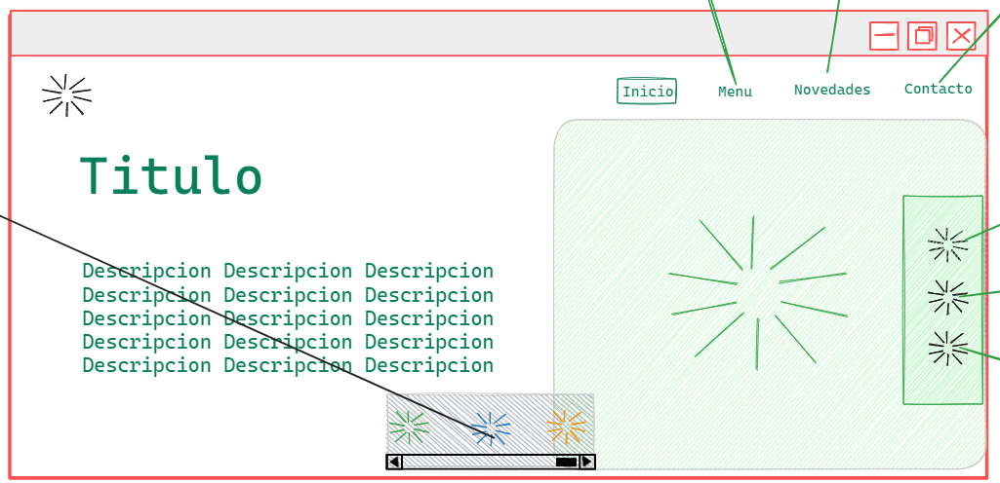

# Diseño

## Diseño Principal

 
Como se puede ver en el diseño principal, contiene un header, se puede ver también que tiene el main divido en un 57% y 43% aproximadamente, dentro del panel de la derecha del main con un padding como del 5% tiene una caja centrada con un titulo de de tipo start dos lineas hacia abajo contiene un texto es muy probable que tenga que rellenarlo con lorem ipsum, en el header a la parte de la izquierda contiene un icono, en el main a la parte de la derecha contiene una imagen y ala derecha de este tambien contiene algunos links

# Fuente

**Nombre:** Poppins

**Link:** https://fonts.google.com/specimen/Poppins?query=po